````markdown
# Azure Cloud-Based Document Management System

A secure, cloud-native **Document Management System** built using **Python, Flask, Microsoft Azure, Azure SQL Database, and Azure Blob Storage**.

The application allows authenticated users to securely upload, manage, download, delete, version, and restore documents while maintaining complete audit logs. The system is deployed on Microsoft Azure with automated CI/CD using GitHub Actions.

---

## Live Demo

**Application:**  
https://documentversionmanagement-ahgxhhfrarhdb3ff.centralindia-01.azurewebsites.net/

---

## Features

- User Registration
- Secure Login Authentication
- Password Hashing using Bcrypt
- Dashboard Analytics
- Document Upload
- Document Download
- Document Delete
- Document Search
- Azure Blob Storage Integration
- Azure Blob Versioning
- Automatic Document Version Creation
- Previous Version Download
- Previous Version Restore
- Version History
- Audit Log Tracking
- Azure SQL Database Integration
- Cloud Deployment using Azure App Service
- Automated CI/CD using GitHub Actions

---

## Azure Services Used

| Azure Service | Purpose |
|---|---|
| **Azure App Service** | Hosts and runs the Flask web application |
| **Azure SQL Database** | Stores users, documents, versions, and audit logs |
| **Azure Blob Storage** | Stores uploaded documents |
| **Azure Blob Versioning** | Maintains previous versions of documents |
| **Azure Deployment Center** | Configures application deployment |
| **GitHub Actions** | Provides automated CI/CD deployment |

---

## System Architecture

```text
                         USER
                           |
                           v
                +----------------------+
                |   Azure App Service  |
                |    Flask Application |
                +----------------------+
                           |
             +-------------+-------------+
             |                           |
             v                           v
   +-------------------+       +----------------------+
   | Azure SQL Database|       | Azure Blob Storage   |
   +-------------------+       +----------------------+
   | Users             |       | Uploaded Documents  |
   | Documents         |       | Blob Versioning     |
   | Versions          |       | Restore Versions    |
   | Audit Logs        |       | Document Download   |
   +-------------------+       +----------------------+

                           ^
                           |
                +----------------------+
                |    GitHub Actions    |
                |   CI/CD Deployment   |
                +----------------------+
                           ^
                           |
                    GitHub Repository
                           ^
                           |
                    Developer / Git
````

---

## Technology Stack

### Backend

* Python
* Flask
* SQLAlchemy
* Flask-Login
* Flask-Bcrypt
* Flask-Migrate

### Frontend

* HTML5
* CSS3
* Bootstrap
* Jinja2

### Database

* Azure SQL Database

### Cloud Storage

* Azure Blob Storage
* Azure Blob Versioning

### Cloud Hosting

* Azure App Service

### CI/CD

* Git
* GitHub
* GitHub Actions
* Azure Deployment Center

---

## Project Modules

### 1. Authentication

The authentication module provides secure user account management.

Features:

* User Registration
* User Login
* User Logout
* Session-based Authentication
* Password Hashing using Bcrypt

---

### 2. Dashboard

The dashboard provides an overview of the document management system.

It displays:

* Total Users
* Total Documents
* Total Versions
* Storage Usage
* Recent Uploads
* Document Statistics

---

### 3. Document Management

The document management module handles the complete document lifecycle.

Features:

* Upload Documents
* Download Documents
* Delete Documents
* Search Documents
* Document Metadata Management
* Cloud Storage Integration

Uploaded files are stored using **Azure Blob Storage**, while document metadata is maintained in **Azure SQL Database**.

---

### 4. Version Management

The version management module provides document version control.

Features:

* Automatic Version Creation
* Version History
* Previous Version Download
* Previous Version Restore
* Azure Blob Versioning

Whenever a document is updated, its previous version can be retained and accessed through the version history.

---

### 5. Audit Logs

The audit logging module records important document activities.

Tracked operations include:

* Upload
* Download
* Delete
* Restore

Audit records are stored in the database for tracking and monitoring user activity.

---

## Database

The application uses **Azure SQL Database** for persistent data storage.

The database maintains information related to:

```text
Users
Documents
Document Versions
Audit Logs
```

Azure SQL provides the relational database layer for the Flask application.

---

## Azure Blob Storage

**Azure Blob Storage** is used for storing uploaded documents.

The storage architecture separates:

```text
Application Data
       |
       +---- Azure SQL Database
       |       |
       |       +---- Users
       |       +---- Documents
       |       +---- Versions
       |       +---- Audit Logs
       |
       +---- Azure Blob Storage
               |
               +---- Uploaded Files
               +---- Blob Versions
```

This allows the application to keep document files in cloud object storage while maintaining their metadata and history in Azure SQL Database.

---

## Security Features

The application implements several security mechanisms:

* Password Hashing using Bcrypt
* Session Authentication
* Environment Variables for Sensitive Configuration
* Secure Azure SQL Database Connection
* Azure Blob Storage Integration
* Authentication-protected Document Operations
* Sensitive credentials excluded from source code

Configuration values are stored using environment variables rather than hard-coded credentials.

---

## Environment Variables

The application requires the following environment variables:

```text
SECRET_KEY=

DATABASE_URL=

AZURE_STORAGE_CONNECTION_STRING=

AZURE_CONTAINER_NAME=
```

These values should be configured locally through a `.env` file or through the Azure App Service application settings.

**Never commit actual credentials, connection strings, or secrets to GitHub.**

---

## Project Structure

```text
Azure-Document-Management-System
│
├── .github
│   └── workflows
│
├── app
│   ├── models
│   ├── routes
│   ├── services
│   ├── templates
│   ├── static
│   ├── utils
│   ├── extensions.py
│   └── config.py
│
├── azure
│
├── database
│
├── diagrams
│
├── docs
│
├── instance
│
├── logs
│
├── migrations
│
├── screenshots
│   ├── auditlogs.png
│   ├── azureblobstorage.png
│   ├── azuredashboard.png
│   ├── azuredatabase.png
│   ├── azuresqldatabase.png
│   ├── dashboard.png
│   ├── dashboard1.png
│   ├── deploymentdashboard.png
│   ├── document.png
│   ├── document1.png
│   ├── grid.png
│   ├── login.png
│   ├── sqlmetrics.png
│   ├── upload.png
│   └── versionhistory.png
│
├── tests
│
├── .gitignore
├── manage.py
├── migrate_sqlite_to_azure.py
├── requirements.txt
├── run.py
├── test_sql.py
└── README.md
```

---

# Screenshots

## Login

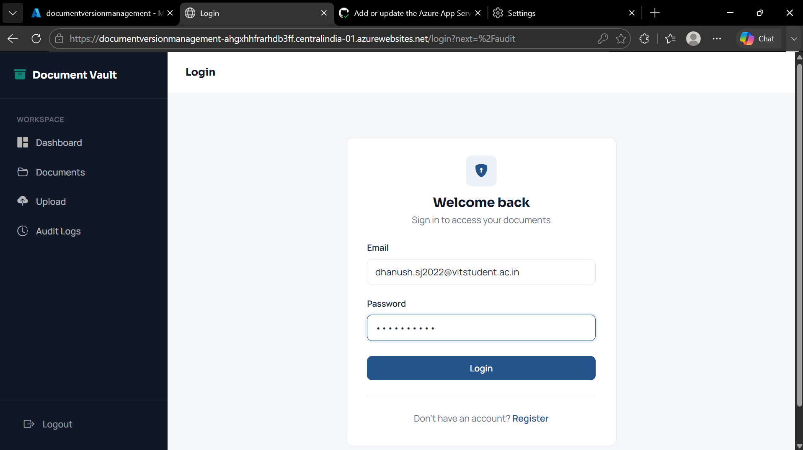

---

## Dashboard

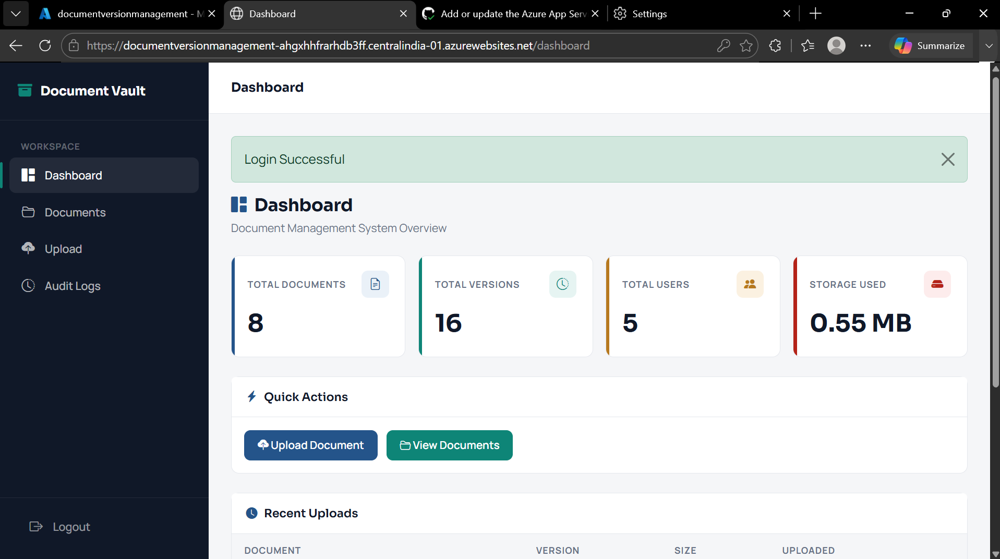

---

## Documents

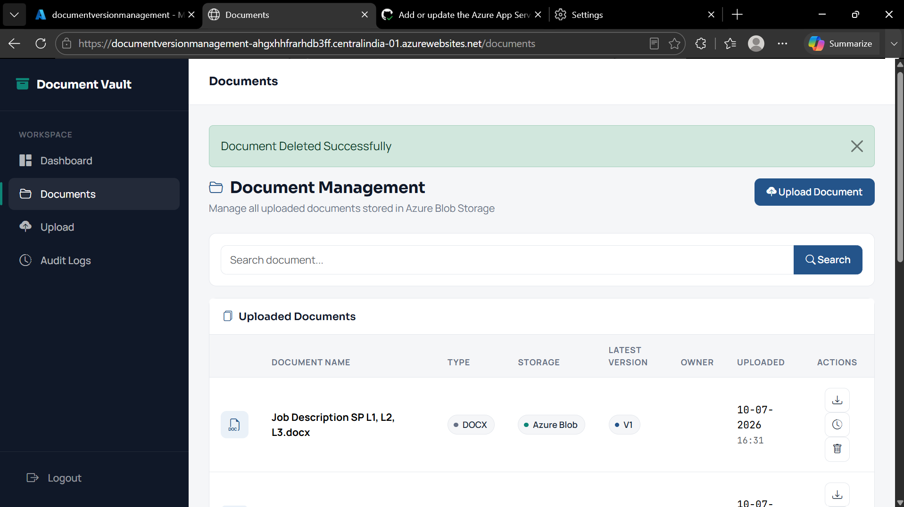

---

## Upload Document

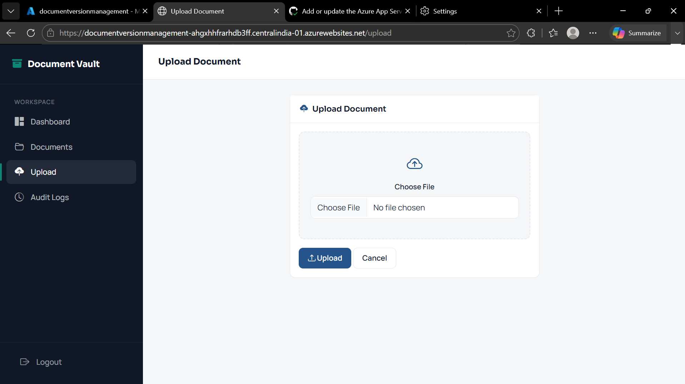

---

## Version History

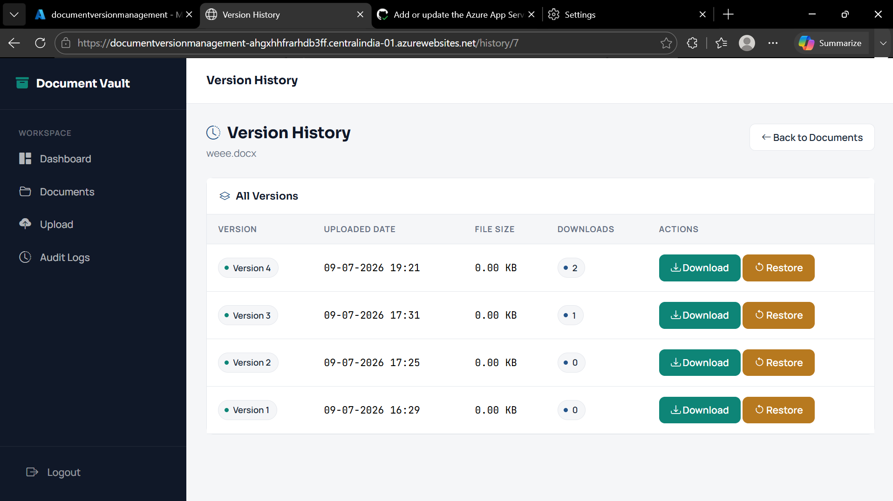

---

## Audit Logs

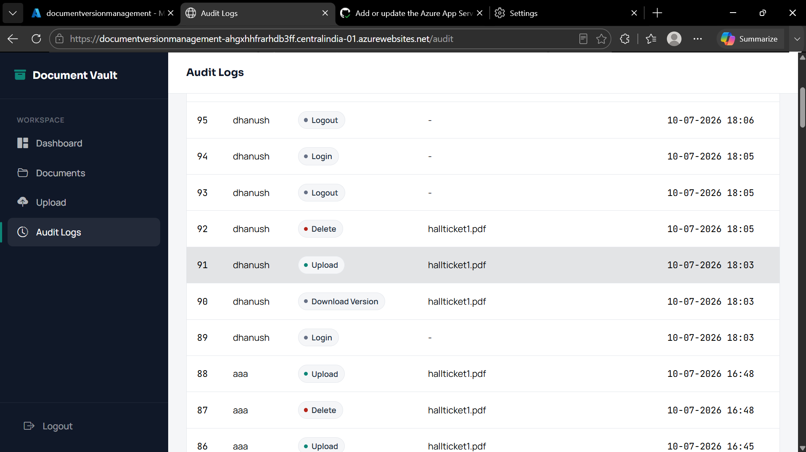

---

## Azure Blob Storage

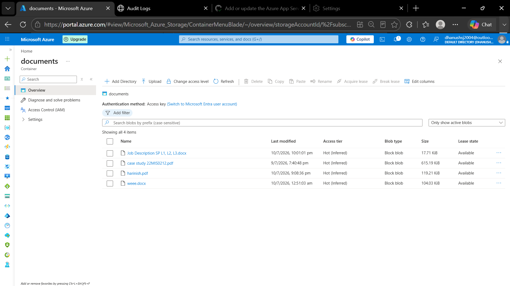

---

## Azure SQL Database

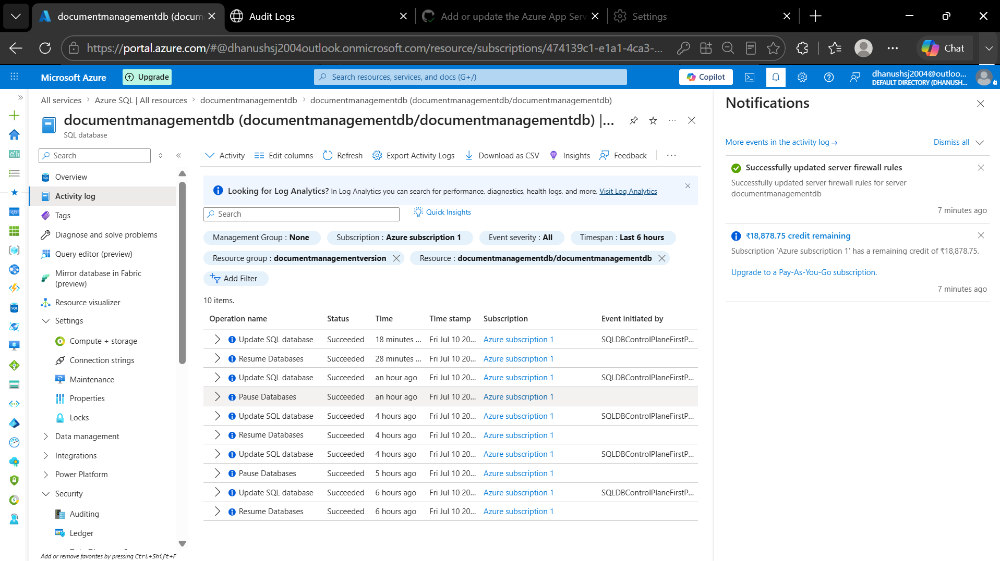

---

## Azure Dashboard

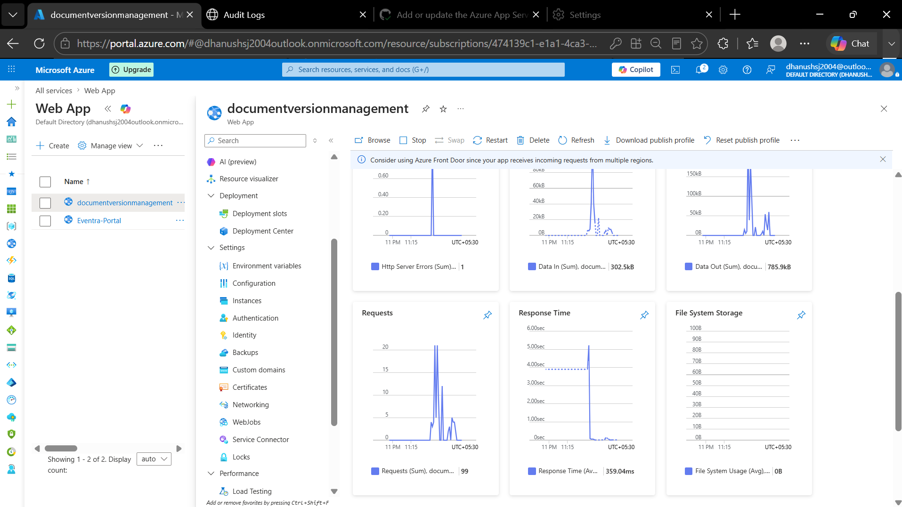

---

## Azure Database

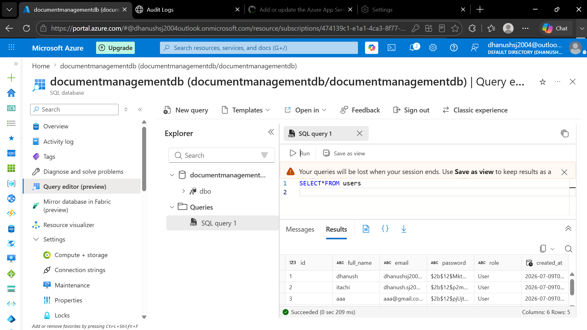

---

## SQL Database Management


---

## Deployment Center

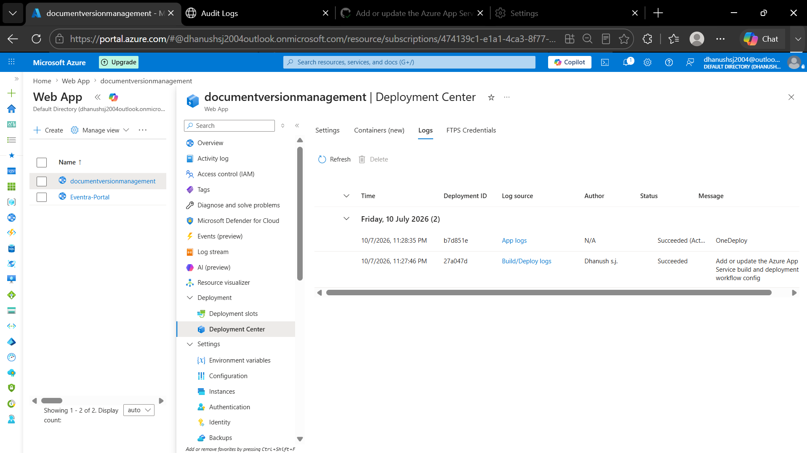

---

## SQL Metrics

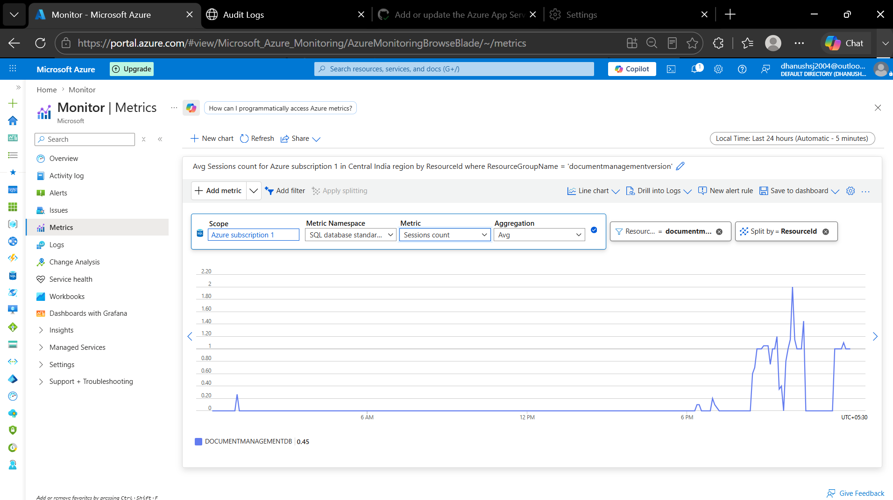

---

## Document Grid

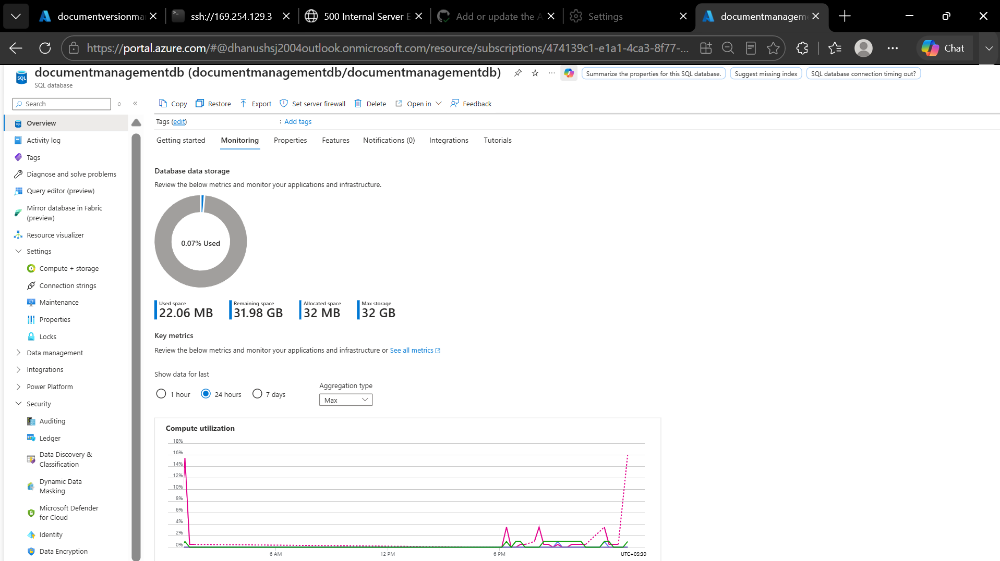

---

## Document Management

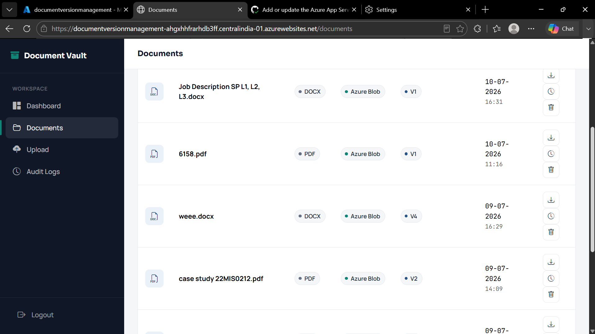

---

## Dashboard Analytics

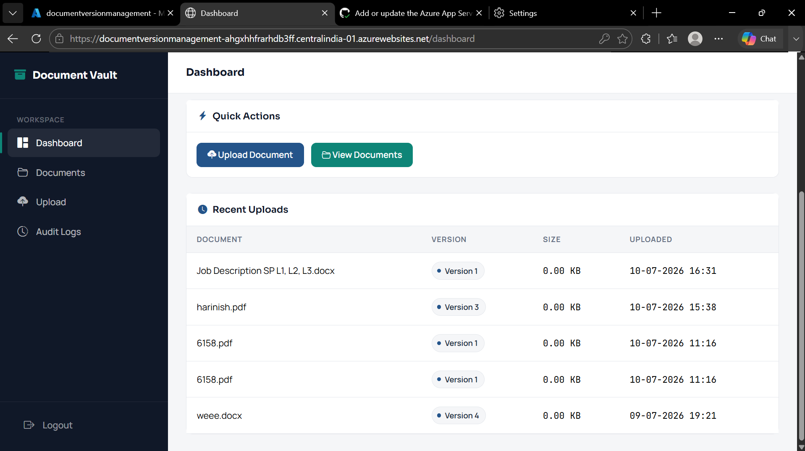

---

# Installation

## 1. Clone the Repository

```bash
git clone https://github.com/Dhanushsj12/Azure-Document-Management-System.git
```

## 2. Navigate to the Project

```bash
cd Azure-Document-Management-System
```

## 3. Create a Virtual Environment

```bash
python -m venv venv
```

## 4. Activate the Virtual Environment

### Windows

```bash
venv\Scripts\activate
```

### Linux / macOS

```bash
source venv/bin/activate
```

## 5. Install Dependencies

```bash
pip install -r requirements.txt
```

## 6. Configure Environment Variables

Create a `.env` file in the project root:

```text
SECRET_KEY=your-secret-key

DATABASE_URL=your-database-connection-string

AZURE_STORAGE_CONNECTION_STRING=your-storage-connection-string

AZURE_CONTAINER_NAME=your-container-name
```

## 7. Run the Application

```bash
flask run
```

The application will be available locally at:

```text
http://127.0.0.1:5000/
```

---

# Deployment

The application is deployed using **Microsoft Azure App Service**.

The deployment workflow is:

```text
Developer
    |
    v
Visual Studio Code
    |
    v
Git
    |
    v
GitHub Repository
    |
    v
GitHub Actions
    |
    v
Azure App Service
    |
    v
Flask Application
```

GitHub Actions automatically builds and deploys the application to Azure App Service whenever changes are pushed to the configured branch.

---

# Cloud Architecture

The project uses a cloud-native architecture consisting of:

```text
                    Internet
                       |
                       v
                Azure App Service
                       |
                Flask Application
                 /             \
                /               \
               v                 v
       Azure SQL Database    Azure Blob Storage
               |                 |
               v                 v
        Application Data     Document Files
               |
               v
          Audit Records
```

---

# Key Project Workflow

### Document Upload

```text
User
  |
  v
Flask Application
  |
  +---- Store Metadata ------> Azure SQL Database
  |
  +---- Store File ----------> Azure Blob Storage
```

### Document Versioning

```text
Document Update
      |
      v
New Document Version
      |
      +---- Database Version Record
      |
      +---- Azure Blob Version
```

### Document Restore

```text
Version History
      |
      v
Select Previous Version
      |
      v
Restore Version
      |
      v
Updated Document
      |
      v
Audit Log Entry
```

---

# CI/CD Pipeline

The project uses GitHub Actions for continuous integration and deployment.

```text
Code Changes
     |
     v
Git Commit
     |
     v
Git Push
     |
     v
GitHub Repository
     |
     v
GitHub Actions
     |
     +---- Build
     |
     +---- Install Dependencies
     |
     +---- Deploy
     |
     v
Azure App Service
```

---

# Future Improvements

Potential future enhancements include:

* Role-Based Access Control
* Admin Dashboard
* AI-Based Document Classification
* OCR Support
* Email Notifications
* Advanced Storage Analytics
* Multi-Factor Authentication
* Document Preview
* Advanced Search and Filtering
* Document Sharing
* User Activity Analytics

---

# Author

**Dhanush S J**

Integrated M.Tech Software Engineering
Vellore Institute of Technology

### GitHub

[https://github.com/Dhanushsj12](https://github.com/Dhanushsj12)

### LinkedIn

[https://www.linkedin.com/in/dhanush-s-j-034147271](https://www.linkedin.com/in/dhanush-s-j-034147271)

---

# License

This project is intended for educational, academic, and learning purposes.

````

